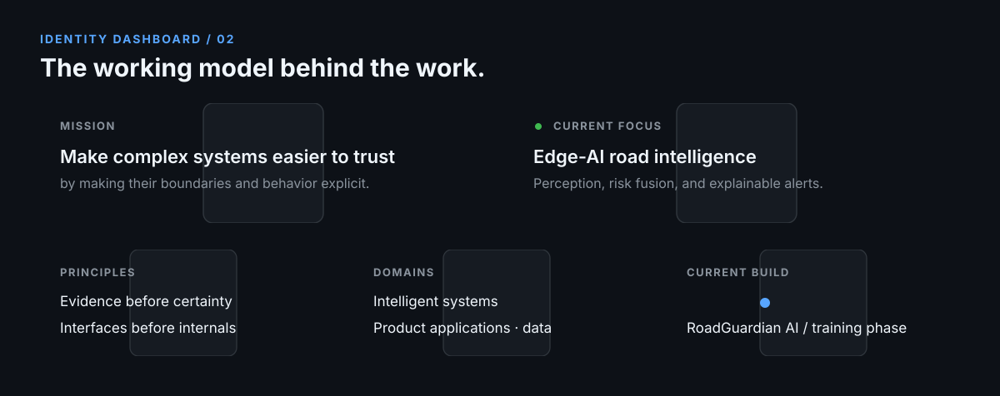
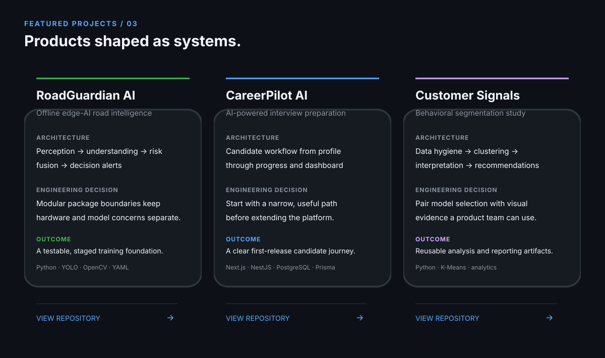
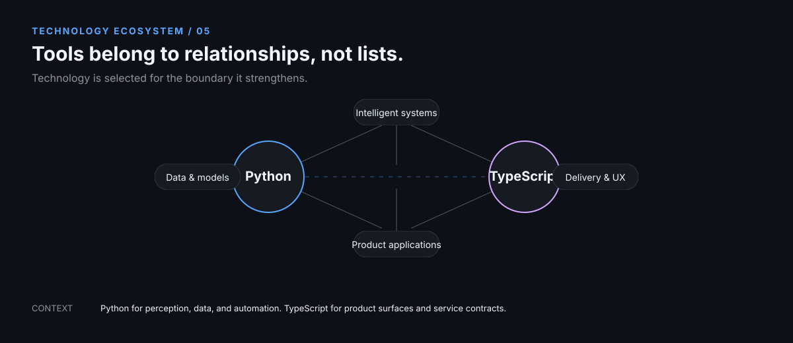
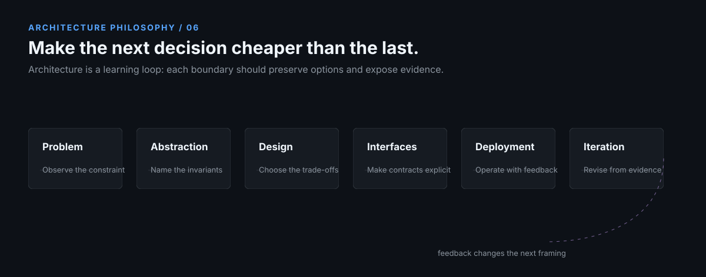
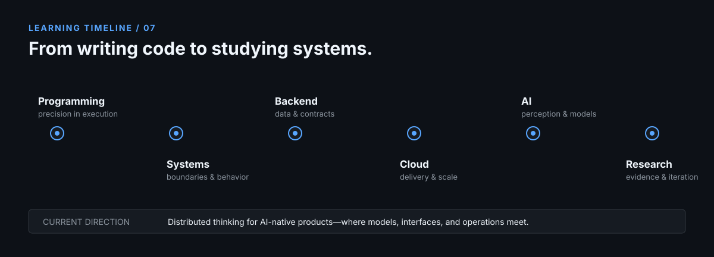
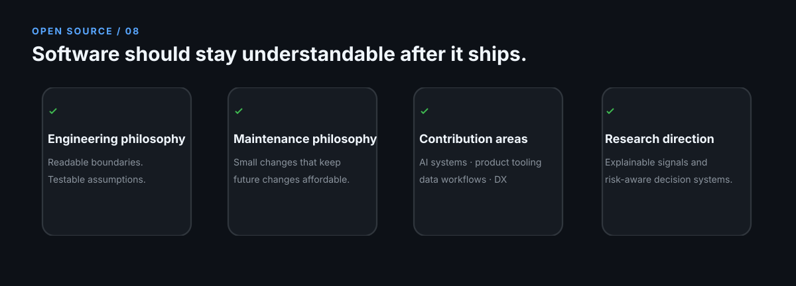
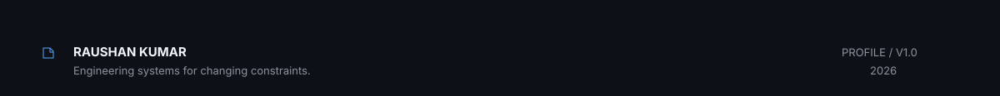

  

  <a href="#identity-dashboard">Identity</a> · <a href="#featured-projects">Selected work</a> · <a href="#architecture-philosophy">Architecture</a> · <a href="#open-source">Open source</a> · <a href="#contact">Contact</a>

## Identity Dashboard

## Featured Projects

  <a href="roadguardian-ai">RoadGuardian AI</a> · <a href="careerpilot-ai">CareerPilot AI</a> · <a href="customer-segmentation-kmeans">Customer Segmentation</a>

## Engineering Metrics

| Signal | Evidence |
| --- | --- |
| System boundaries | RoadGuardian separates perception, understanding, risk, decision, video, training, and dataset concerns. |
| Product scope | CareerPilot starts with the candidate workflow: identity, progress tracking, and a dashboard. |
| Validation posture | RoadGuardian includes phase validation, configuration checks, and focused tests. |
| Learning practice | The Algorithmic Recognition Atlas records observation, falsification, model selection, and time-control methods. |

## Technology Ecosystem

## Architecture Philosophy

## Learning Timeline

## Open Source

## Contact

The most useful conversations start with a real problem: a product constraint, an uncertain model boundary, or a system that needs to become easier to change.

  <a href="mailto:raushankr3005@gmail.com">raushankr3005@gmail.com</a> · <a href="https://github.com/raushankr-30">github.com/raushankr-30</a>

